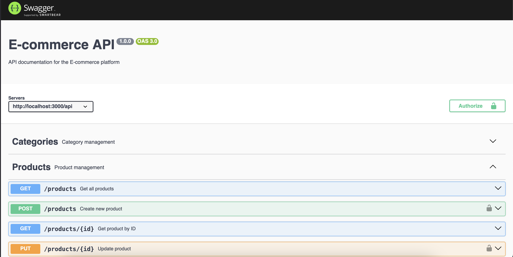

# E-commerce clean architecture

This is a modular E-commerce backend application built with Node.js, Express, and MongoDB, following Clean Architecture principles.
It provides a robust backend for managing products, categories, orders, customers, staff, discounts, inventory, analytics, and more.


## Clean Architecture Overview

The project is structured around Clean Architecture to ensure maintainability, scalability, and testability:

```bash
src/
├── domain/             # Core business rules & entities
│   ├── product/
│   ├── category/
│   ├── order/
│   ├── customer/
│   ├── staff/
│   └── discount/
├── application/        # Use-cases, DTOs, validators
│   ├── use-cases/
│   └── validators/
├── infrastructure/     # Frameworks, database, external integrations
│   ├── database/       # Mongoose repositories
│   ├── email/          # Email service
│   └── analytics/      # Reporting & analytics
├── presentation/       # HTTP layer (routes, controllers, middleware)
│   ├── http/
│   │   ├── controllers/
│   │   ├── routes/
│   │   └── middleware/
└── config/             # Environment configs

```

## Benefits of this Architecture

- Framework-independent core: Domain and use-cases don’t depend on Express, Mongoose, or other frameworks.

- Testable: Business logic can be tested independently of external services.

- Extensible: New features, APIs, or services can be added without breaking existing functionality.

- Readable & maintainable: Each layer has a single responsibility.


## Features
- Authentication & Authorization

JWT-based authentication

Role-based access for admin, staff, and customers

- Product Management

Create, update, delete products

Assign products to multiple categories

Support for variants, images, and attributes

Fetch products by ID, slug, or category

- Category Management

CRUD for product categories

Validation with DTOs

- Orders & Transactions

Create and track orders

Update order statuses

Integration with payment gateways

- Customers & Staff

Manage customer data

Add, update, and disable staff accounts

- Discounts / Coupons

Create and apply discount codes

Percentage or fixed discounts

- Inventory & Stock

Track product stock quantities

Update stock after orders

- Analytics & Reports

Dashboard with sales, orders, and expenses metrics

Generate reports for accounting or marketing

- Email Notifications

Send order confirmations and updates

Integration with SMTP or third-party email providers

- Leads Management

Add and track leads for marketing or sales


## Layers & Responsibilities
- Domain Layer

Core business rules

Entities (Product, Category, Order, Customer, Staff)

Repository interfaces (abstracting database access)

- Application Layer

Use-cases (business logic implementations)

DTOs and validators (zod)

Orchestrates interactions between domain and infrastructure

- Infrastructure Layer

Database (MongoDB via Mongoose)

External services (email, analytics)

Implements repository interfaces

- Presentation Layer

HTTP API with Express

Controllers, routes, and middleware

Swagger for API documentation


## Tech Stack

- Backend: Node.js, Express

- Database: MongoDB + Mongoose

- Validation: Zod

- Authentication: JWT

- Documentation: Swagger

- Testing: Jest / Supertest

- Architecture: Clean Architecture (Domain-Driven Design principles)


## Installation

### Clone the repository:

```bash
git clone https://github.com/psalmsin1759/ecommerce_nodejs_clean_architecture.git
cd ecommerce-backend

```

### Install dependencies:

```bash
npm install
```

### Configure environment variables:
Create .env file based on .env.example
```bash
PORT=5000
MONGO_URI=mongodb://localhost:27017/ecommerce
JWT_SECRET=your_jwt_secret

```

### Start the server:
```bash
npm run dev

```

### API documentation:
Open http://localhost:5000/api-docs


### Testing

Run all tests:

```bash
npm test

```

### Seeding

Seed orders, products, customers:

```bash
npm run seed

```